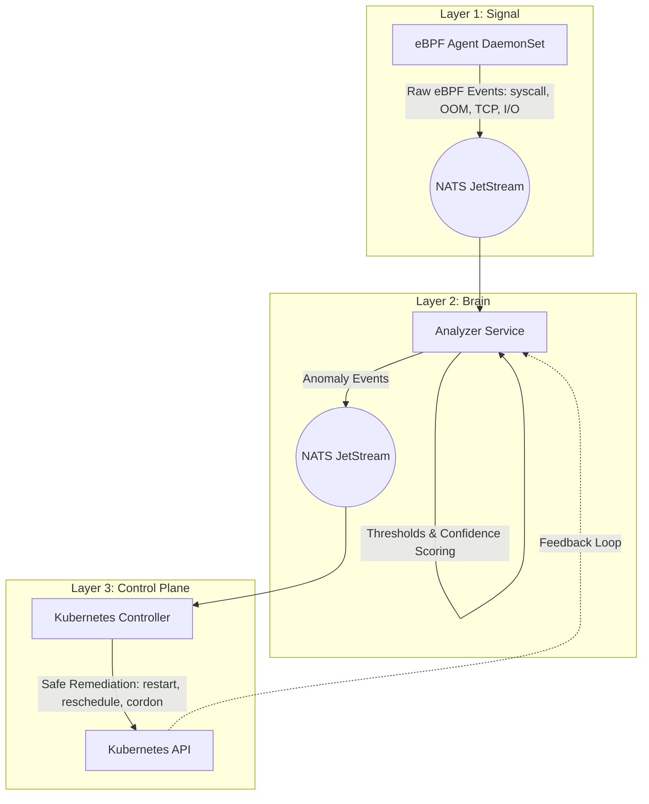

<div align="center">
  <h1>Self-Healing Kubernetes Control Plane</h1>
  <p><b>A production-grade, kernel-aware autonomous healing system for Kubernetes.</b></p>
  
  [](https://golang.org/)
  [](https://ebpf.io/)
  [](https://kubernetes.io/)
  [](https://nats.io/)
</div>

---

## Overview

**SelfHeal-CP** is a three-layer autonomous healing system that observes Kubernetes workloads at kernel depth, detects anomalies using a deterministic heuristics engine, and executes safe, reversible remediation actions — entirely without human intervention.

Unlike traditional HPA or alerting systems, SelfHeal-CP goes deep into the kernel using **eBPF** to capture syscall latencies, OOM kills, TCP retransmits, and disk I/O, providing unparalleled visibility and deterministic fault resolution.

## Key Features

- **Kernel-Aware Telemetry**: Uses CO-RE eBPF probes for syscalls, memory (OOM), block I/O, and network events.
- **Deterministic Heuristics Engine**: Correlates multiple signals, scores confidence, and triggers anomalies without heavy ML dependencies.
- **Safe by Design**: Built-in guardrails, cooldown state machines, dry-run modes, and blast radius limits (max 1 action / cluster / 10s).
- **Cloud-Agnostic**: Works on bare metal, EKS, GKE, AKS, or on-prem clusters.
- **Deep Observability**: Integrates seamlessly with Prometheus and Grafana for audit trails and node health scoring.

## Architecture

The system operates across three distinct layers:



## Quick Start

### Prerequisites

- Linux Kernel 5.10+ (BTF/CO-RE support)
- Kubernetes 1.27+
- eBPF Toolchain (`clang`, `llvm`, `libbpf-dev`, `linux-headers`)
- Go 1.22+

### Development Environment

1. **Start the local dev stack** (NATS, Prometheus, Grafana):
   ```bash
   make dev-up
   ```

2. **Build the eBPF probes**:
   ```bash
   make bpf
   ```

3. **Build the components**:
   ```bash
   make agent-build
   make controller-build
   # make analyzer-build (if applicable)
   ```

4. **Run the agent locally** (Requires root for eBPF):
   ```bash
   sudo make run-agent
   ```

5. **Run the test suite**:
   ```bash
   make test
   ```

## PART II: TECHNICAL DOCUMENTATION

### 8. High-Level Architecture
SelfHeal-CP is built on a decoupled, three-layer architecture designed for high availability, low latency, and explicit separation of concerns.

- **Layer 1: Observation (The Eyes)** - Per-node eBPF agents.
- **Layer 2: Brain (The Logic)** - Stateful heuristics engine.
- **Layer 3: Control Plane (The Hands)** - Kubernetes reconciliation controller.

Communication between these layers is handled exclusively by a high-throughput Event Bus (NATS JetStream or Kafka).

### 9. Core Components Deep-Dive

#### 9.1 The eBPF Agent Daemon (cmd/agent)
Deployed as a DaemonSet, this component runs on every Linux node in the cluster.

- **Kernel Space**: Uses C and libbpf to attach probes to tracepoints (e.g., `tracepoint/raw_syscalls/sys_enter`). It avoids context-switching overhead by aggregating data inside BPF maps before sending it to userspace.
- **User Space**: A Go application that reads the BPF ring buffer.
- **The PID to Pod Challenge**: eBPF only knows about PIDs (Process IDs). The agent uses the containerd CRI socket and Kubernetes API informers to dynamically map a kernel PID to a cgroup, then to a container ID, and finally to a Kubernetes Pod Name and Namespace. This mapping is cached in a fast LRU BPF map.

#### 9.2 The Analyzer Service (cmd/analyzer)
This is a stateful stream processing application written in Go.

- **Sliding Windows**: It maintains in-memory sliding windows of metrics (e.g., IO wait over the last 30s) for every pod.
- **Threshold Rules**: Evaluates metrics against YAML-defined rules (e.g., if `oom_kill_count > 1` within 5m).
- **Correlation Engine**: A single metric spike can be noise. The Analyzer correlates multiple signals. For example, high IO wait + a spike in syscall latency = highly confident disk bottleneck. This dramatically reduces false positives.
- **Confidence Scoring**: Outputs an `AnomalyEvent` containing a confidence score (0.0 to 1.0) and a suggested root cause.

#### 9.3 The Kubernetes Controller (cmd/controller)
The execution arm, built using client-go and controller-runtime.

- **Action Dispatcher**: Receives `AnomalyEvents` and decides how to patch the Kubernetes API. Actions include `restart_pod`, `patch_resource_limits`, `reschedule_pod`, or `cordon_node`.
- **Guardrails Evaluator**: Before making any API call, it checks the YAML Guardrail policy. If a pod has been restarted 3 times in an hour, the rate limiter blocks the 4th restart and escalates the issue.
- **Feedback Loop**: Emits `ActionEvents` and `OutcomeEvents`. It observes the cluster state after an action to determine if the anomaly was successfully resolved.

### 10. Data Flow & Communication Contracts
The system uses Protocol Buffers (Protobuf) over the Event Bus to ensure strict typing and backward compatibility.

- **SignalEvent**: Emitted by the Agent. Contains Node, Pod, Namespace, Metric Name, Value, and Timestamp.
- **AnomalyEvent**: Emitted by the Analyzer. Contains Anomaly ID, Type, Confidence Score, Affected Pod, Suggested Cause, and TTL.
- **ActionEvent**: Emitted by the Controller. Contains Action ID, Target Kind (e.g., Deployment), Reason, and whether it was a Dry Run.

### 11. Heuristics & Decision Engine
The core of the system is deterministic in Phases 1-3. We avoid Machine Learning initially to ensure explainability.

- **State Machine**: Anomalies track state: `OBSERVING` -> `ACTION_TAKEN` -> `RESOLVED` or `ESCALATING`.
- **Single-Signal Penalty**: If only one signal spikes, the confidence score is artificially penalized (-0.20) to prevent knee-jerk reactions to kernel noise.

### 12. Guardrails & Safety Mechanisms
Autonomous systems are dangerous without brakes.

- **Dry-Run Mode**: The system can evaluate the entire pipeline and print the intended Kubernetes patch without actually applying it.
- **Global Circuit Breaker**: If >50% of actions fail to resolve their anomalies within a 5-minute window, the entire system pauses autonomous action and pages a human.
- **Cooldowns**: A pod cannot be restarted twice within 60 seconds.

### 13. Implementation Phases & Roadmap
- **Phase 1: Kernel Vision**. Focus on building the eBPF agent, deploying probes, and perfectly mapping PIDs to Pods.
- **Phase 2: Brain Online**. Building the NATS event bus, the sliding window aggregator, and the confidence scoring engine.
- **Phase 3: Healing Actions**. The Kubernetes controller, the Guardrail system, and end-to-end feedback loops.
- **Phase 4: Causal Inference**. Building dependency graphs (Pod -> Node -> Volume) to attribute multiple pod anomalies to a single failing hardware component.
- **Phase 5: AI Layer**. Integrating local LLMs (like Ollama) to translate complex JSON anomaly/action trails into human-readable Slack summaries (e.g., "Disk bottleneck on node-3 caused latency. I rescheduled api-server to node-7.").

### 14. Security & Observability
- **Least Privilege**: The Agent requires `CAP_BPF` and `CAP_PERFMON`, but nothing else. The Controller requires specific RBAC roles (e.g., patch pods, cordon nodes) but cannot delete namespaces or read secrets.
- **Prometheus Metrics**: Every component exposes a `/metrics` endpoint. Key metrics include `selfheal_signals_total`, `selfheal_anomalies_detected_total`, and `selfheal_action_latency_ms`.
- **Audit Trail**: Every action is strictly logged and can be exported to standard SIEMs (Splunk, Datadog) via the Event Bus for compliance and post-mortem analysis.


